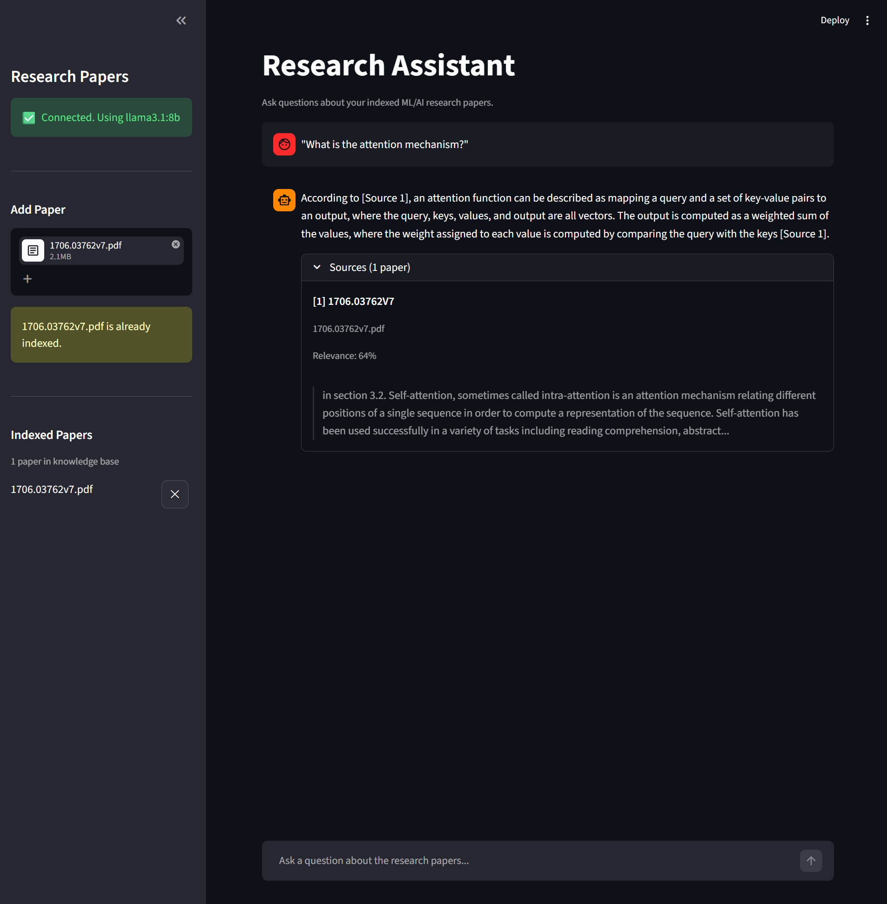

# Research Assistant

A fully local RAG chatbot for querying ML and AI research papers. Upload a PDF, ask questions about it, and get answers that are grounded in the actual content of the paper with citations showing exactly where the information came from.



## How it works

When you upload a paper, the system splits the text into overlapping chunks and converts each one into an embedding vector, which is essentially a mathematical representation of what that chunk means. Those vectors get stored in a local database. When you ask a question, the question gets embedded in the same way, and the system finds the chunks that are closest in meaning using cosine similarity. Those chunks get passed to a local language model along with your question, and it writes an answer based on what it just read.

This is called RAG (Retrieval-Augmented Generation) because the model retrieves relevant content before generating a response, rather than relying on what it learnt during training. The main benefit is that it can answer questions about documents it has never seen, and you can verify every answer against the source.

## Architecture

```
PDF upload
    │
    ▼
pdf_loader.py       Extracts text with pdfplumber, handles multi-column layouts
    │
    ▼
chunker.py          Splits text into 800-character overlapping windows
    │                 (overlap prevents losing context at boundaries)
    ▼
embedder.py         Converts each chunk to a 768-dim vector via BAAI/bge-base-en-v1.5
    │
    ▼
vectorstore.py      Stores vectors + text + metadata in ChromaDB (persisted to disk)
    │
    ▼  (at query time)
retriever.py        Embeds the question, retrieves top-5 chunks by cosine similarity
    │
    ▼
llm.py              Passes retrieved context + question to llama3.1:8b via Ollama
    │
    ▼
Streamlit UI        Streams the response token-by-token, renders source citations
```


## Stack

| Component | Technology |
|---|---|
| Language model | llama3.1:8b via [Ollama](https://ollama.com) |
| Embedding model | BAAI/bge-base-en-v1.5 via sentence-transformers |
| Vector database | ChromaDB |
| PDF parsing | pdfplumber |
| UI | Streamlit |
| Container | Docker + Docker Compose |

## Setup

**Requirements:** Python 3.11+, [Ollama](https://ollama.com/download) installed and running, around 6 GB free disk space for model weights, and at least 8 GB RAM.

### Native install (Windows, macOS, Linux)

```bash
git clone https://github.com/IvanBeeT/rag-research-assistant.git
cd rag-research-assistant

python -m venv .venv

# Windows
.venv\Scripts\activate
# macOS / Linux
source .venv/bin/activate

pip install -r requirements.txt

# One-time model download (~4.9 GB)
ollama pull llama3.1:8b
```

Then start the app:

```bash
streamlit run app/main.py
```

Open `http://localhost:8501`. Upload a PDF using the sidebar, and start asking questions. The embedding model (~440 MB) will download automatically on the first run.

### Docker

The Docker setup runs the app and Ollama as separate containers, which is the cleanest way to reproduce the environment on another machine.

```bash
docker compose up --build

# In a separate terminal, pull the model into the Ollama container
docker compose exec ollama ollama pull llama3.1:8b
```

Open `http://localhost:8501`.

GPU acceleration in Docker requires the [NVIDIA Container Toolkit](https://docs.nvidia.com/datacenter/cloud-native/container-toolkit/install-guide.html) on Linux. Uncomment the `deploy` block in `docker-compose.yml` to enable it. On Windows and macOS, Ollama runs natively and picks up the GPU automatically.

## Configuration

Copy `.env.example` to `.env` to override any defaults.

| Variable | Default | Description |
|---|---|---|
| `OLLAMA_MODEL` | `llama3.1:8b` | Any model pulled via `ollama pull` |
| `EMBED_MODEL` | `BAAI/bge-base-en-v1.5` | Any sentence-transformers model |
| `CHUNK_SIZE` | `800` | Characters per chunk |
| `CHUNK_OVERLAP` | `100` | Overlap between consecutive chunks |
| `TOP_K` | `5` | Passages retrieved per query |
| `OLLAMA_HOST` | `http://localhost:11434` | Ollama API endpoint |

To use a larger model:

```bash
ollama pull qwen2.5:14b
# set OLLAMA_MODEL=qwen2.5:14b in .env
```

To index papers in bulk rather than uploading through the UI, drop PDFs into `data/papers/` and run `python ingest.py`.

## Acknowledgements

Built with assistance from [Claude Code](https://claude.ai/code) (Anthropic).
